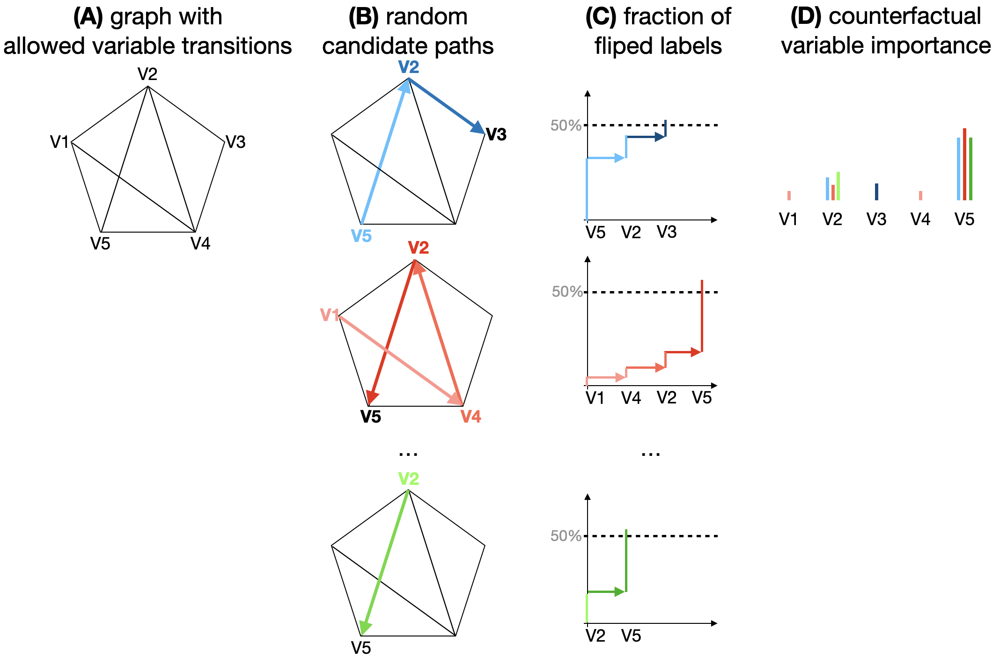

# cpath

## Explaining and visualizing black-box models through counterfactual paths

Paper: https://arxiv.org/abs/2307.07764
Software documentation:
https://github.com/pievos101/cpath/blob/main/cpath_documentation.pdf

<p align="center">
    <a href="https://arxiv.org/abs/2307.07764">
        
    </a>
    <a href="https://arxiv.org/abs/2307.07764">
        
    </a>
</p>


## Installation
The {cpath} R-package can be installed using {devtools}.

```r
install.packages("devtools")
library(devtools)

devtools::install_github("pievos101/cpath")
library(cpath)

```

## Usage

Lets apply {cpath} on a random forest model. 

```r
library(caret)
library(cpath)
 
# Generate simulated data
res  = sim()
data = res$data
target = as.factor(res$target)

# Train-test split 

## 80% of the sample size
smp_size <- floor(0.80 * nrow(data))

train_ind <- sample(seq_len(nrow(data)), size = smp_size)

train <- data[train_ind, ]
test  <- data[-train_ind, ]

target_train = as.factor(target[train_ind])
target_test  = as.factor(target[-train_ind])

TRAIN = as.data.frame(cbind(train, target_train))
TRAIN$target_train = as.factor(TRAIN$target_train)

#10 folds repeat 3 times
control <- trainControl(method='repeatedcv', 
                        number=10, 
                        repeats=3)
#Metric compare model is Accuracy
metric <- "Accuracy"
set.seed(123)
#Number randomly variable selected is mtry
mtry <- sqrt(ncol(train))
tunegrid <- expand.grid(.mtry=mtry)
model <- train(target_train~., 
                      data=TRAIN, 
                      method='rf', 
                      metric='Accuracy', 
                      tuneGrid=tunegrid, 
                      trControl=control)
print(model)

# Get the counterfactual paths
P   = cpath::cpaths(model, test, k=4, n_paths = 1000)
# P   = cpath::cpaths_mc(model, test, k=4, n_paths = 1000) #multi-core

# Build transition matrix 
T   = cpath::transition(P)

# Get global feature importances
IMP = cpath::importance(T)
print(IMP)

# Get summary of the counterfactual paths
cpath_summary = get_cpath_summary(P)

# Plot the paths
plot_paths(cpath_summary)

####################################
# The RL Q-Learning solution
####################################
cp_q <- cpaths_rl(model, test, k=4)
print(cp_q$importance)

```

## Citation

If you find {cpath} useful please cite [our paper](https://arxiv.org/abs/2307.07764):

```
@article{pfeifer2023explaining,
    title   = {Explaining and visualizing black-box models through counterfactual paths}, 
    author  = {Bastian Pfeifer and Mateusz Krzyzinski and Hubert Baniecki and
               Anna Saranti and Andreas Holzinger and Przemyslaw Biecek},
    year    = {2023},
    journal = {arXiv preprint, arXiv:2307.07764}
}
```
